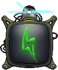

# Atomatic

**An alien gets stranded on earth. Use its technology to help him return to its home!**
Embark on an extraterrestrial adventure like no other in “Atomatic”! An alien has crash-landed on Earth and needs your help to get back to its home planet. The catch? The alien generates energy and its equipped with an array of advanced technologies capable of generating otherworldly energy. Your mission is to harness these advanced devices and power up the spacecraft to ensure a safe journey back to the stars!

This is a game being developed by students from <a href="https://www.imagecampus.edu.ar/">Image Campus</a>

   

## Credits

- **Barra Santiago** - *Programming*
- **Rodriguez Giles Juan** - *Programming*
- **De Bonis Lucas Martín** - *Art*
- **Gigena Daniel Carlos Tomas** - *Art*
- **Santos Ortega Isidro** - *Art*
- **Sanchez Walter** - *Art*
- **Alonso Santiago José** - *Audio*
- **Jaramillo Solar Rodrigo** - *Audio*
- **Marco Pilar** - *Audio*
- **Navarro Azurmendi Ignacio** - *Audio*
- **Duran Federico** - *Testing*
- **Fernández Gordano M. Florencia** - *Testing*
- **Lasdica Ignacio Benjamín** - *Testing*
- **Nervi Maxy** - *Testing*

This game was also possible thanks to the support of these professors:

- **Sergio Baretto**
- **Juan Pablo Varela Aloisio**
- **Ramiro Cabrera**
- **Eugenio Taboada**
- **Nazareno Rivero**
- **Lucía Inés Patetta**

## Acknowledgements

- **Federico Barra**
- **Franco Guerra**
- **Silvina Lemos Hoffmann**

## Links

Download it from itch.io: https://santiagobarra.itch.io/atomatic?password=Atomatic
